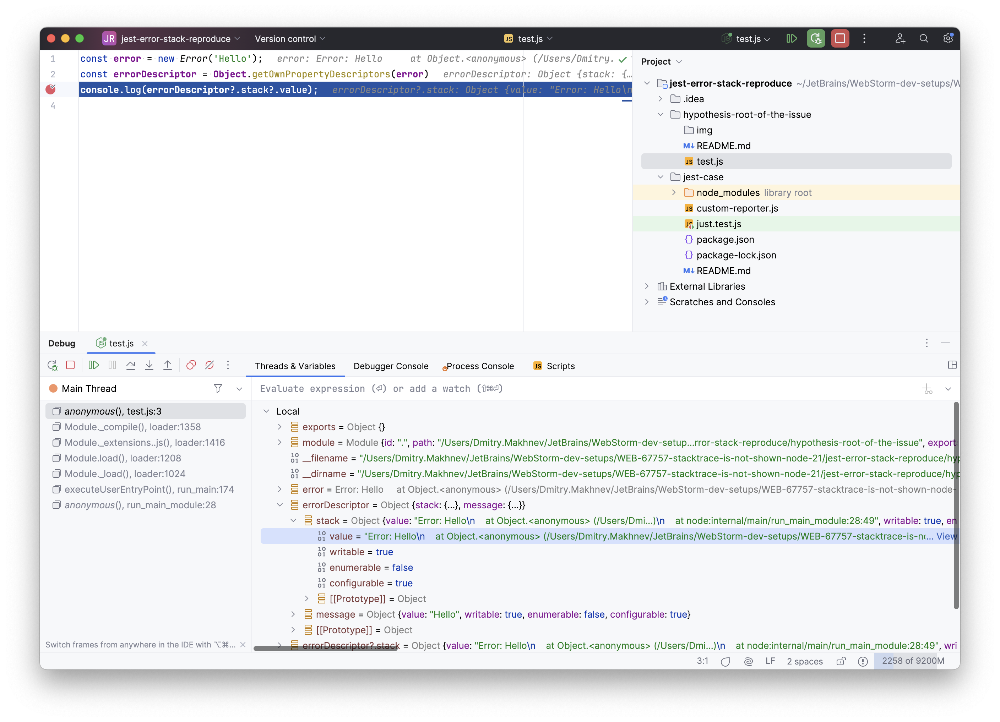
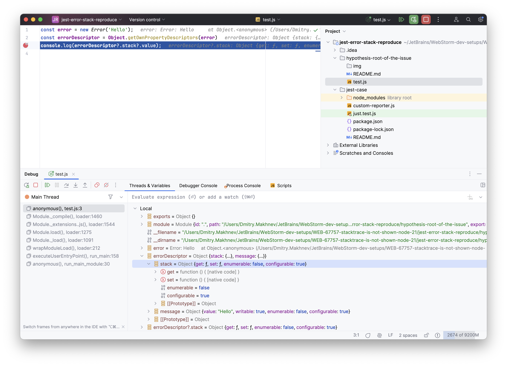
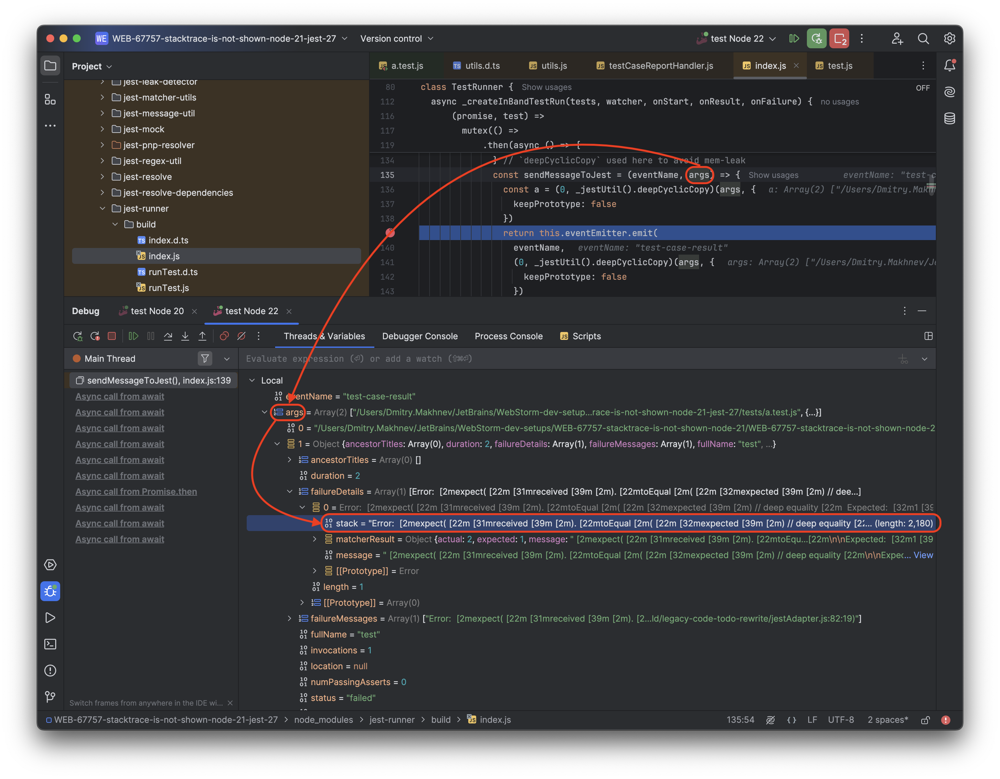
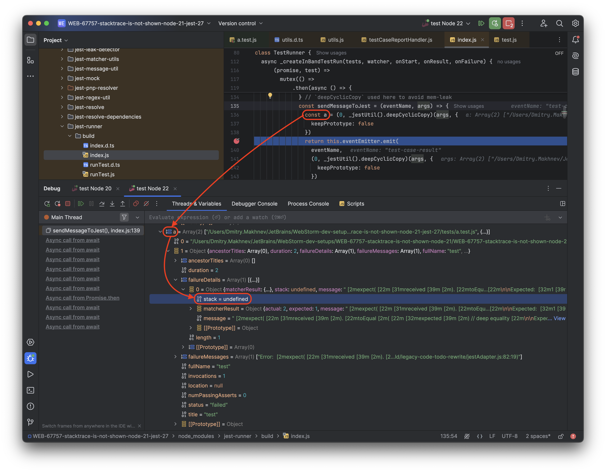

## Hypothesized root cause of the issue

When `jest-runner` [sends the message to Jest](https://github.com/jestjs/jest/blob/5736ae386e473584c0b57578d074e1d8e5d8242b/packages/jest-runner/src/index.ts#L211)
before the sending it uses [`deepCyclicCopy()`](https://github.com/jestjs/jest/blob/5736ae386e473584c0b57578d074e1d8e5d8242b/packages/jest-util/src/deepCyclicCopy.ts#L15)
for arguments.
`deepCyclicCopy()` inside [uses `Object.getOwnPropertyDescriptors`](https://github.com/jestjs/jest/blob/5736ae386e473584c0b57578d074e1d8e5d8242b/packages/jest-util/src/deepCyclicCopy.ts#L41)
for objects.
Since Node.js 21.0.0 [`Object.getOwnPropertyDescriptors()`](https://developer.mozilla.org/en-US/docs/Web/JavaScript/Reference/Global_Objects/Object/getOwnPropertyDescriptor)
doesn't return `value` property for `stack` descriptor of an error.

### Reproducing

Use Node.js < 21 and run:
```shell
node ./test.js
```

In the output, you'll see the error stack value:
```
Error: Hello
    at Object.<anonymous> ...
```

Use Node.js 21+ and run:
```shell
node ./test.js
```

In the output, you'll see `undefined`.  

It looks like after Node.js 21 [the `stack` property of `Error`](https://developer.mozilla.org/en-US/docs/Web/JavaScript/Reference/Global_Objects/Error/stack)
behavior changed.

#### Debug info

- Node.js 20.15.1 
- Node.js 21.0.1 
- Node.js 22.3.0 

In jest
- `args` with `stack`  
- `args` clone without `stack`  


